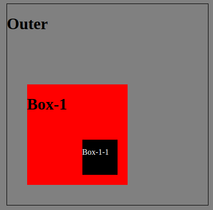
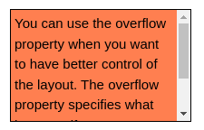
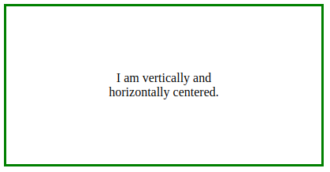

# Include Stylesheet in HTML

```html
<head>
  <meta charset="UTF-8" />
  <meta name="viewport" content="width=device-width, initial-scale=1.0" />
  <!-- set the path to css file-->
  <link rel="stylesheet" href="path/to/file.css" />
  <title>Document</title>
</head>
```

# Reset all values

```css
* {
  /* The width and height of the element include the content, padding, and border. */
  box-sizing: border-box;
}

body {
  margin: 0;
  padding: 0;
}
```

# Grid Display

## Grid Sizing

Create a 2x2 grid

```css
.grid-example {
  display: grid;
  grid-template-columns: 1fr 2fr; /* create two grids with a ratio 1:2 */
  grid-template-rows: 1fr 1fr; /* create two grids with a 1:1 ration */
  gap: 10px; /* gap between grids */
}
```

Repeat the same x times: repeat (times, size)

```css
.container {
  display: grid;
  grid-template-columns: repeat(8, 4em);
  grid-template-rows: repeat(8, 4em);
  gap: 10px;
}
```

## Grid Placement

```css
.container {
  grid-column: span 2; /* takes a columns */
  grid-row: span 3; /* takes 3 rows*/
}
```

# Positioning

| Position Value | Description                                                                                                                                                       |
| -------------- | ----------------------------------------------------------------------------------------------------------------------------------------------------------------- |
| `static`       | **Default**: Elements are positioned in the normal flow of the document. They are not affected by the `top`, `bottom`, `left`, or `right` properties.             |
| `relative`     | Elements are positioned relative to their normal position in the document flow. You can use `top`, `bottom`, `left`, or `right` properties to offset the element. |
| `absolute`     | Elements are removed from the normal document flow and positioned relative to the nearest positioned ancestor (or the initial containing block if none).          |
| `fixed`        | Elements are positioned relative to the viewport (the browser window). They do not move when the page is scrolled.                                                |
| `sticky`       | Elements are positioned based on the user's scroll position. They behave like `relative` until they reach a specified offset, then they become `fixed`.           |

## Absolute-Realtive

```css
.outer {
  position: relative;
}

.box-1 {
  position: absolute;
  bottom: 10%;
  left: 10%;
}

.box-1-1 {
  position: absolute;
  right: 10%;
  bottom: 10%;
}
```



## Sticky

```css
position: sticky;
top: 20px; /* space between element and parent*/
```

# Overflow

```css
div {
  overflow: auto;
}
```



# Layout

## Center Page

```css
body {
  display: flex;
  justify-content: center;
  align-items: center;
  min-height: 100vh;
}
```

## Center Item in div

```css
.item {
  margin: auto;
}
```

## Center horizontal and vertical

```css
.container {
  text-align: center;
  height: 200px;
  width: 400px;
  position: relative;
  border: 3px solid green;
}

.center {
  margin: 0;
  position: absolute;
  top: 50%;
  left: 50%;
  -ms-transform: translate(-50%, -50%);
  transform: translate(-50%, -50%);
}
```

```html
<div class="container">
  <div class="center">
    <p>I am vertically and horizontally centered.</p>
  </div>
</div>
```



# Font Awesome

Adding Font Awesome

```html
<link
  rel="stylesheet"
  href="https://use.fontawesome.com/releases/v5.15.4/css/all.css"
  integrity="sha384-DyZ88mC6Up2uqS4h/KRgHuoeGwBcD4Ng9SiP4dIRy0EXTlnuz47vAwmeGwVChigm"
  crossorigin="anonymous"
/>
```
