```bash
pip install pyqt6
```

# Main Window Shell

```python
from PyQt6.QtWidgets import QApplication, QMainWindow
import sys

class MainWindowShell(QMainWindow):

    def __init__(self):

        super().__init__()
        self.setWindowTitle("Menu Example")
        self.setFixedWidth(300)
        self.setFixedHeight(300)

if __name__ == '__main__':
    app = QApplication([])
    window = MainWindowShell()
    window.show()
    sys.exit(app.exec())
```

# Main Window with Geometry

```python
from PyQt6.QtWidgets import QApplication, QMainWindow, QLabel, QPushButton
import sys

class GeometryExample(QMainWindow):

    def __init__(self):

        super().__init__()

        # Components
        # Add self to place them on the board
        self.label = QLabel("Push the button", self)
        self.btn = QPushButton("Push", self)

        # Set the geometry of the widgets
        # Left, Top, width, heigh
        self.label.setGeometry(10, 10, 120, 20)
        self.btn.setGeometry(30, 60, 70, 20)

if __name__ == '__main__':
    app = QApplication([])
    window = GeometryExample()
    window.show()
    sys.exit(app.exec())
```

# PushButton

```python
from PyQt6.QtWidgets import QApplication, QMainWindow, QPushButton
import sys

class QPushButtonExample(QMainWindow):

    def __init__(self):

        super().__init__()
        self.setWindowTitle("Menu Example")
        self.setFixedWidth(100)
        self.setFixedHeight(100)

        self.btn = QPushButton("Exit", self)    # create the button
        self.btn.clicked.connect(self.exit_app) # connect a function to the button

    def exit_app(self):
        '''
        Function the will be connected to the button
        ''' 
        sys.exit()

if __name__ == '__main__':
    app = QApplication([])
    window = QPushButtonExample()
    window.show()
    sys.exit(app.exec())
```

<div style="text-align: center;">

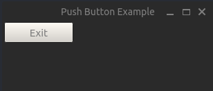

</div>

# Label

```python
from PyQt6.QtWidgets import QApplication, QMainWindow, QLabel
import sys

class QLabelExample(QMainWindow):

    def __init__(self):

        super().__init__()
        self.setWindowTitle("Menu Example")
        self.setFixedWidth(200)
        self.setFixedHeight(100)

        self.label = QLabel("This is a label", self)    # create the label
        self.label.setMaximumWidth(200)                 # set max width
        print(self.label.text())                        # get the label  text
        self.label.setText("Label Value Changed")       # change the label text

if __name__ == '__main__':
    app = QApplication([])
    window = QLabelExample()
    window.show()
    sys.exit(app.exec())
```

<div style="text-align: center;">

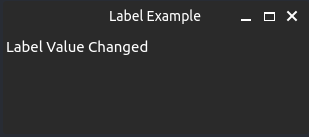

</div>

# TextEdit
```python
from PyQt6.QtWidgets import QApplication, QMainWindow, QTextEdit
import sys

class TextEditExample(QMainWindow):

    def __init__(self):

        super().__init__()
        self.setWindowTitle("Text Edit Example")
        self.setFixedWidth(500)
        self.setFixedHeight(500)

        self.text_edit = QTextEdit("", self)    # Create a Text edit with blank value
        self.text_edit.setFixedSize(400, 400)   # Set the size
        self.text_edit.setText("preset text")   # Preset a value
        self.text_edit.setReadOnly(False)       # Set editable to True/False
        print(self.text_edit.toPlainText())     # Get the


if __name__ == '__main__':
    app = QApplication([])
    window = TextEditExample()
    window.show()
    sys.exit(app.exec())
```

<div style="text-align: center;">

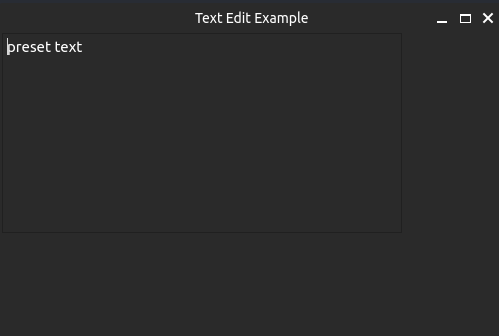

</div>

# ComboBox

```python
from PyQt6.QtWidgets import QApplication, QMainWindow, QComboBox
import sys

class ComboBoxExample(QMainWindow):

    def __init__(self):

        super().__init__()
        self.setWindowTitle("Menu Example")
        self.setFixedWidth(300)
        self.setFixedHeight(300)

        dropdown = QComboBox(self)
        dropdown.addItems(["Metric", "Imperial"])
        print(dropdown.currentText())

if __name__ == '__main__':
    app = QApplication([])
    window = ComboBoxExample()
    window.show()
    sys.exit(app.exec())
```

<div style="display: flex; flex-direction: colum; justify-content: center;">

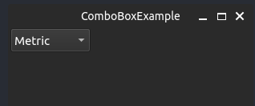

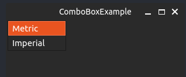

</div>


# LineEdit

```python
from PyQt6.QtWidgets import QApplication, QMainWindow, QLineEdit
import sys

class MainWindowShell(QMainWindow):

    def __init__(self):

        super().__init__()
        self.setWindowTitle("Line Edit Example")
        self.setFixedWidth(300)
        self.setFixedHeight(100)

        self.enter_text = QLineEdit(self)
        self.enter_text.setFixedWidth(150)
        self.enter_text.setPlaceholderText("Text")
        print(self.enter_text.text())                       # get the text
        

if __name__ == '__main__':
    app = QApplication([])
    window = MainWindowShell()
    window.show()
    sys.exit(app.exec())
```

<div style="text-align: center;">

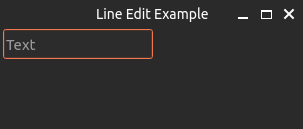

</div>

# ToolBar
```python
from PyQt6.QtWidgets import QApplication, QMainWindow, QToolBar
from PyQt6.QtGui import QAction
import sys

class ToolbarExample(QMainWindow):
    def __init__(self):
        super().__init__()

        # Create a toolbar and add it to the main window
        toolbar = QToolBar('My Toolbar', self)
        toolbar.setMovable(True)
        self.addToolBar(toolbar)

        # Add actions to the toolbar
        action1 = QAction('Action 1', self)
        action1.triggered.connect(self.action1_triggered)
        toolbar.addAction(action1)

    def action1_triggered(self):
        print('Action 1 triggered')

if __name__ == '__main__':
    app = QApplication([])
    window = ToolbarExample()
    window.show()
    sys.exit(app.exec())
```

<div style="text-align: center;">

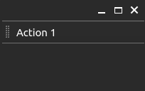

</div>

# Status Bar

```python
from PyQt6.QtWidgets import QApplication, QMainWindow, QStatusBar
import sys


class StatusBarExample(QMainWindow):
    def __init__(self):
        super().__init__()

        # Create a status bar and add it to the main window
        statusbar = QStatusBar()
        self.setStatusBar(statusbar)

        # Set the initial message on the status bar
        statusbar.showMessage('Ready')


if __name__ == '__main__':
    app = QApplication([])
    window = StatusBarExample()
    window.show()
    sys.exit(app.exec())
```

<div style="text-align: center;">

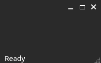

</div>

# Menu Bar

```python
from PyQt6.QtWidgets import QApplication, QMainWindow
from PyQt6.QtGui import QAction
import sys


class MenuBarExample(QMainWindow):

    def __init__(self):

        super().__init__()
        self.setWindowTitle("Menu Example")

        # Create a menu bar item. & Creates a keyboard shortcut
        menu_bar_item = self.menuBar().addMenu("&File")

        # Create a sub menu. Add self to connect it to the class
        sub_action = QAction("Sub Action", self)
        sub_action.triggered.connect(self.sub_click_handler)
        menu_bar_item.addAction(sub_action)

    def sub_click_handler(self):
        print("Do Something")

if __name__ == '__main__':
    app = QApplication([])
    window = MenuBarExample()
    window.show()
    sys.exit(app.exec())
```

<div style="text-align: center;">

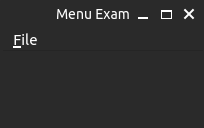

</div>

# Message Box (pop up)

```python
from PyQt6.QtWidgets import QApplication, QMainWindow, QMessageBox, QPushButton
import sys

# For other messages boxes
# https://www.pythontutorial.net/pyqt/pyqt-qmessagebox/
class QMessageBoxExample(QMainWindow):
    def __init__(self):
        super().__init__()

        QPushButton("Click Me", self).clicked.connect(self.show_message)

    def show_message(self):

        # Create a message box
        message_box = QMessageBox.question(self, 'Confirmation', "Do you accept", 
                                           QMessageBox.StandardButton.Yes | 
                                           QMessageBox.StandardButton.No)
        
        # Check what is clicked
        if message_box == QMessageBox.StandardButton.Yes:
            print("User Clicked Yes")
        
        if message_box == QMessageBox.StandardButton.No:
            print("User Clicked No")

if __name__ == '__main__':
    app = QApplication([])
    window = QMessageBoxExample()
    window.show()
    sys.exit(app.exec())
```

<div style="display: flex; flex-direction: colum; justify-content: center;">

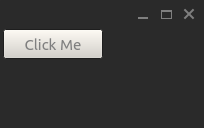

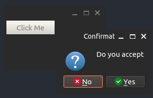

</div>

# Multi Window

```python
from PyQt6.QtWidgets import QApplication, QMainWindow, QLabel, QToolBar
from PyQt6.QtGui import QAction
import sys


class MainWindow(QMainWindow):
    def __init__(self):
        super().__init__()
        self.setWindowTitle("Multi Window Example")
        # TOOLBAR
        toolbar = QToolBar(self)
        self.addToolBar(toolbar)
        # ToolBar Actions
        generate_password_action = QAction("Window 1", self)
        generate_password_action.triggered.connect(self.show_window_one)
        toolbar.addAction(generate_password_action)

        passwords_action = QAction("Window 2", self)
        passwords_action.triggered.connect(self.show_window_two)
        toolbar.addAction(passwords_action)

    def show_window_one(self):
        self.setCentralWidget(WindowOne())

    def show_window_two(self):
        self.setCentralWidget(WindowTwo())


class WindowOne(QMainWindow):
    def __init__(self):
        super().__init__()
        QLabel("Window1", self).setGeometry(10, 40, 200, 20)


class WindowTwo(QMainWindow):
    def __init__(self):
        super().__init__()
        QLabel("Window2", self).setGeometry(10, 40, 200, 20)


if __name__ == '__main__':
    app = QApplication([])
    window = MainWindow()
    window.show()
    sys.exit(app.exec())
```

# Table

```python
from PyQt6.QtWidgets import QApplication, QMainWindow
from PyQt6.QtWidgets import QTableWidget, QTableWidgetItem
import sys

fakeData =[("Rits", "16"), ("Mavis", "5"), ("Lilly", "2")]

class MainWindowShell(QMainWindow):

    def __init__(self):

        super().__init__()
        self.setWindowTitle("Menu Example")

        table = QTableWidget(len(fakeData), 2, self)        # rows, columns
        table.setHorizontalHeaderLabels(['Name', 'Age'])    # Set the column labels
        table.setRowCount(len(fakeData))                    # set the amount of rows

        for idx, record in enumerate(fakeData):
            name, age = record
            table.setItem(idx, 0, QTableWidgetItem(name))
            table.setItem(idx, 1, QTableWidgetItem(age))

        # Resize the columns and rows to fit the contents
        table.resizeColumnsToContents()
        table.resizeRowsToContents()

        self.setCentralWidget(table) 

if __name__ == '__main__':
    app = QApplication([])
    window = MainWindowShell()
    window.show()
    sys.exit(app.exec())
```

<div style="text-align: center;">

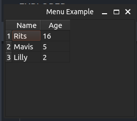

</div>

## Other Table Functions

```python
from PyQt6.QtWidgets import QApplication, QMainWindow
from PyQt6.QtWidgets import QTableWidget, QTableWidgetItem
import sys

fakeData =[("Rits", "16"), ("Mavis", "5"), ("Lilly", "2")]

class MainWindowShell(QMainWindow):

    def __init__(self):

        super().__init__()
        self.setWindowTitle("Menu Example")

        self.table = QTableWidget(len(fakeData), 2, self)        # rows, columns
        self.table.setHorizontalHeaderLabels(['Name', 'Age'])    # Set the column labels
        self.table.setRowCount(len(fakeData))                    # set the amount of rows
        self.table.cellClicked.connect(self.print_cell_info)     # assign function to each cell click
        self.table.cellDoubleClicked.connect(self.remove_row)

        for idx, record in enumerate(fakeData):
            name, age = record
            self.table.setItem(idx, 0, QTableWidgetItem(name))
            self.table.setItem(idx, 1, QTableWidgetItem(age))
            self.table.setItem(idx, 3, QTableWidgetItem("x"))

        # Resize the columns and rows to fit the contents
        self.table.resizeColumnsToContents()
        self.table.resizeRowsToContents()

        self.setCentralWidget(self.table)

    def print_cell_info(self):
        print(self.table.currentItem().text())      # text of the selected cell
        print(self.table.currentRow())              # print the current row
        print(self.table.currentColumn())

    def remove_row(self):
       current_row = self.table.currentRow()
       self.table.removeRow(current_row)


if __name__ == '__main__':
    app = QApplication([])
    window = MainWindowShell()
    window.show()
    sys.exit(app.exec())
```

# Copy To Clipboard

```python
from PyQt6.QtWidgets import QApplication

def copy_to_clipboard(self):
        clipboard = QApplication.clipboard()
        clipboard.setText('Whatever Text')
```